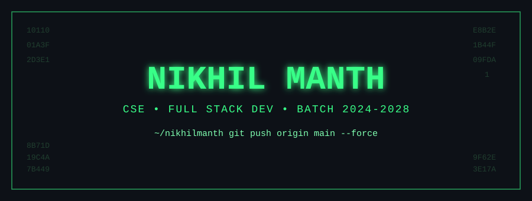
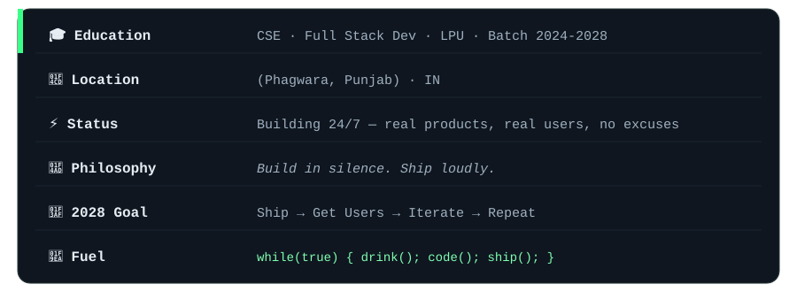

<p align="center">
  
</p>

<p align="center">
  <code><b>root@nikhil-os:~$ sudo whoami</b></code>
</p>

<p align="center">
  <a href="https://www.linkedin.com/in/nikhil-manth/" target="_blank">
    
  </a>
  <a href="https://github.com/Nikhilmanth" target="_blank">
    
  </a>
  
  
</p>

<br/>

```txt
+----------------------------------------------------+
|                NIKHIL-OS  v1.0-cse                  |
+------------------------------------------------------
| [ SYS ]  Loading identity modules ........ [ OK ]   |
| [ NET ]  Connecting to GitHub universe ... [ OK ]   |
| [ AI  ]  Booting developer mindset ....... [ OK ]   |
| [ SEC ]  Initializing ethical firewall ... [ OK ]   |
| [ PKG ]  Installing caffeine ............. [FAIL]   |
| [ GIT ]  git push origin main --force .... [ OK ]   |
+------------------------------------------------------
```

<br/>

## 🧬 Identity

<p align="center">
  
</p>

<br/>

## 🛠️ Tech Arsenal

<p align="center"><sub><b>◆ LANGUAGES</b></sub></p>
<p align="center">
  <a href="https://developer.mozilla.org/en-US/docs/Web/JavaScript" target="_blank"></a>
  <a href="https://www.typescriptlang.org/" target="_blank"></a>
  <a href="https://www.python.org/" target="_blank"></a>
  <a href="https://cplusplus.com/" target="_blank"></a>
</p>

<p align="center"><sub><b>◆ FRONTEND · BACKEND</b></sub></p>
<p align="center">
  <a href="https://developer.mozilla.org/en-US/docs/Web/HTML" target="_blank"></a>
  <a href="https://developer.mozilla.org/en-US/docs/Web/CSS" target="_blank"></a>
  <a href="https://react.dev/" target="_blank"></a>
  <a href="https://nodejs.org/" target="_blank"></a>
  <a href="https://expressjs.com/" target="_blank"></a>
  <a href="https://tailwindcss.com/" target="_blank"></a>
</p>

<p align="center"><sub><b>◆ CLOUD · DATABASE · INFRA</b></sub></p>
<p align="center">
  <a href="https://www.mongodb.com/" target="_blank"></a>
  <a href="https://firebase.google.com/" target="_blank"></a>
  <a href="https://aws.amazon.com/" target="_blank"></a>
  <a href="https://www.docker.com/" target="_blank"></a>
</p>

<p align="center"><sub><b>◆ TOOLS · SECURITY</b></sub></p>
<p align="center">
  <a href="https://git-scm.com/" target="_blank"></a>
  <a href="https://github.com/" target="_blank"></a>
  <a href="https://code.visualstudio.com/" target="_blank"></a>
  <a href="https://www.postman.com/" target="_blank"></a>
</p>

<br/>

## 📡 Skills Loading...

<p align="center">
  
</p>

<br/>

## 📊 Metrics

<p align="center">
  
</p>

<p align="center">
  
  
</p>

<br/>

## 📈 Activity

<p align="center">
  
</p>

<br/>

## 🐍 Contribution Grid

<p align="center">
  <picture>
    <source media="(prefers-color-scheme: dark)" srcset="https://raw.githubusercontent.com/Nikhilmanth/Nikhilmanth/output/github-contribution-grid-snake-dark.svg" />
    <source media="(prefers-color-scheme: light)" srcset="https://raw.githubusercontent.com/Nikhilmanth/Nikhilmanth/output/github-contribution-grid-snake.svg" />
    
  </picture>
</p>

<br/>

<p align="center">
  <i>"The quieter you become, the more you can hear."</i>
</p>

<p align="center">
  <a href="https://www.linkedin.com/in/nikhil-manth/" target="_blank">
    
  </a>
</p>

<p align="center"><sub>Building since 2024 · Still going · Connection closed by remote host.</sub></p>

<p align="center">
  
</p>
